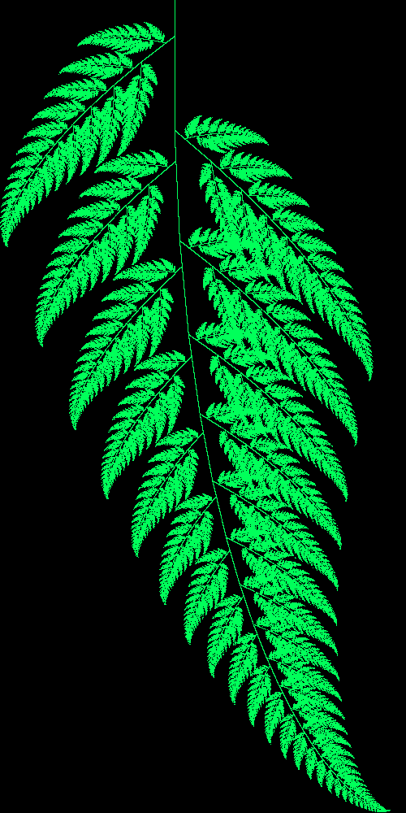
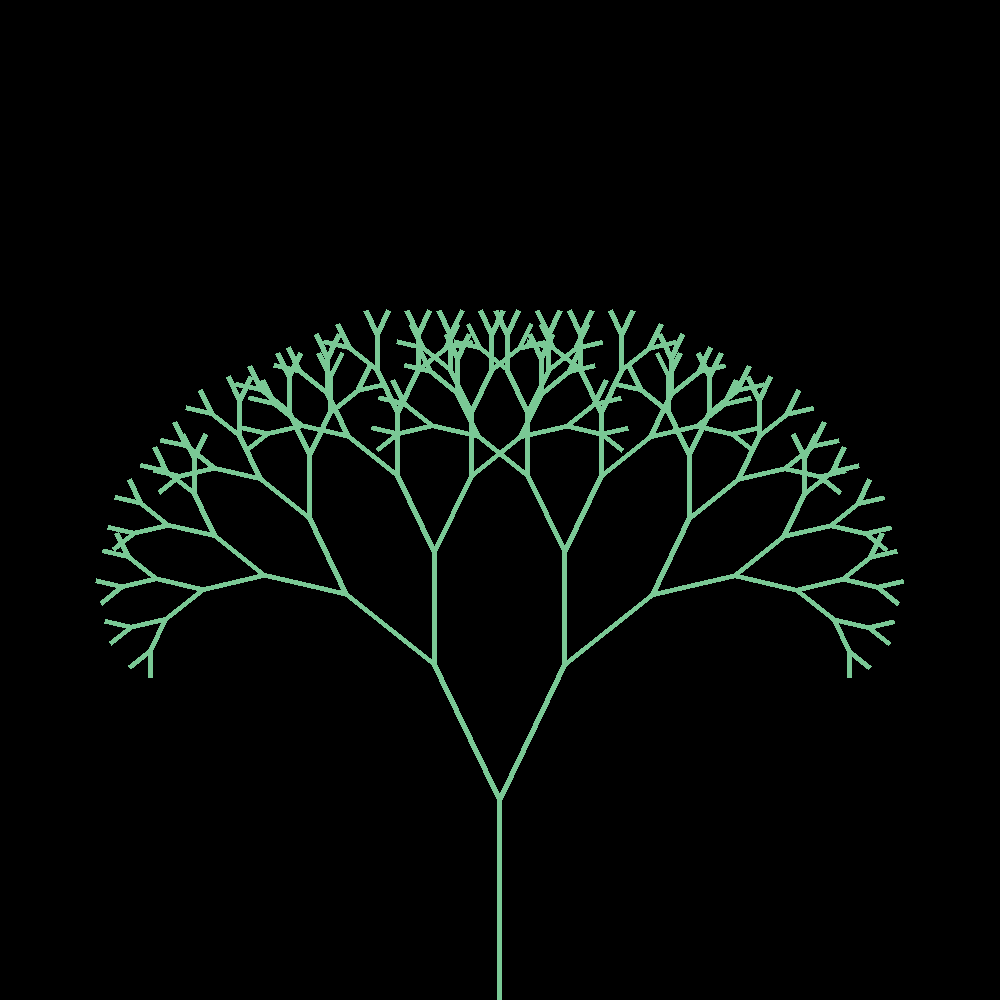

# Fractals

## Drawing Pixels in Python

### Pillow
Pillow is a _fork_ of the Python Image Library allows drawing and manipulation images in Python. 
It can be installed using pip:

```
python3 -m pip install --upgrade pip
python3 -m pip install --upgrade Pillow
```
For our purposes we need to
- create an Image object (using HSV or RGB)
- use ```putpixel(position, colour)``` to draw a pixel onto that image. In this case:
  - position is a tuple of two values: x and y. 
  - colour is tuple of 3 values: Hue, Saturation, Value or Red, Green, Blue depending on the image type. 
- Display the image using ```show()```

```python
from PIL import Image

size = (255, 255)
image = Image.new('HSV', size)
max_x, max_y = size
for x in range(max_x):
    for y in range(max_y):
        hue = x
        saturation = y
        value = 255
        image.putpixel((x ,y), (hue, saturation, value))

image.show()
```
You can also save the image to a file. Some file formats require RGB instead of HSV.

```python
image = image.convert('RGB')
image.save('drawing.png', 'PNG')
```
If you want to draw lines instead of individual pixels you can create a draw object for the image:
```python
draw = ImageDraw.Draw(image)
draw.line([x1, y1, x2, y2])
```
See the documentation for more details: https://pillow.readthedocs.io/en/stable/reference/ImageDraw.html

### OpenCV

Pillow doesn't do video or live updating of images very well. One alternative is to use OpenCV. This uses _numpy_ arrays so there is a slightly steeper learning curve.
An image is stored as a numpy array of values. You can create an empty image like this:

- create a numpy array to hold the pixel data
- update individual pixels by setting the relevent values in the array
- set up a loop
- continually display the image using ```imshow()```
- ```imshow()``` won't create a new window each time. Instead it updates an existing window if one exists.

```python
import cv2
import numpy as np

image = np.zeros(shape=(100, 100, 3))

image[(50, 50)] = (255, 255, 255)

while True:
    cv2.imshow('image', image)
    if cv2.waitKey(1) == ord('q'):
        break
```

## Sierpinski

- The basic traingle using Chaos Game
- Explanation why it works: <https://en.wikipedia.org/wiki/Chaos_game>
- Extend to other shapes...

## Koch Curve

- <https://en.wikipedia.org/wiki/Koch_snowflake>

Use PIL ImageDraw to draw lines.
Create a KochCurve class:

| property | Description|
|---|---|
|initial_line | The coordinates of the line which should be recursively redrawn|
| depth | The number of recursions to draw |
| image | The PIL image object that the curve will be drawn onto |
| draw | The PIL ImageDraw object that is used to draw lines onto an image |

```python
from PIL import Image, ImageDraw
class KochCurve():
    def __init__(self, initial_line, depth):
        self.initial_line = initial_line
        self.depth = depth
        self.image = Image.new('RGB', (2000, 2000))
        self.draw = ImageDraw.Draw(self.image)
```


Create a method that returns a series of lines relative to a start and end point. This is the shape of a single segment of the Koch curve. This involves a bit of vector maths which numpy can make easier.
In this example, 
- v is a line one third the length of the full segment. 
- point c is the where the line turns 90 degrees.

```python
import numpy as np
...
    def q1_curve(self, start_point, end_point):
        v = (np.array(end_point) - np.array(start_point))/3
        a = start_point
        b = tuple(start_point + v)
        c = tuple(np.array(b) + np.array([v[1], -v[0]]) )
        d = tuple(c + v)
        e = tuple(end_point - v)
        f = end_point
        lines = [[a, b]]
        lines.append([b,c])
        lines.append([c,d])
        lines.append([d,e])
        lines.append([e,f])
        return lines
```

The recursive part of the algorithm happens here:
```python
  def draw_segment(self, start_point, end_point, depth):
        lines = self.curve_func(self, start_point, end_point)
        for line in lines:
            if depth <= 0:
                self.draw.line(line, fill=self.fill),
            else:
                self.draw_segment(line[0], line[1], depth-1)
```

If we have reached depth = 0, just draw the series of lines returned by the previous function.
If depth > 0 we want to instead draw a smaller segment where each line would go, so this function calls itself recursively, but _with a lower value for depth_.


## Barnsley Fern

- Similar random technique for drawing it
- Using separate arrays for data and image

## Mandelbrot

- Explanation of the technique (see numberphile/computerphile video?)
- Full image (b&w)
- Add colour
- Zooming in on an area
- Julia set?

## Fractal Trees

Start with a line, the initial branch. Each branch splits into two similar but shorter branches, that are directed a 
certain angle either side of the parent branch.


### The FractalTree class

```python
class FractalTree():
    def __init__(self, initial_line, scale_factor, angle, depth):
        self.angle = angle
        self.initial_line = [np.array(initial_line[0]), np.array(initial_line[1])]
        self.scale_factor = scale_factor
        self.depth = depth
        self.branches = [initial_line]
```
| Property | Description|
|---|---|
|initial_line | Two pairs of coordinates that specify the  starting branch of the tree. Each pair gets converted into a numpy array to make dealing with them easier later on. |
| scale factor | How much smaller each child branch is than its parent. |
| angle | The angle by which each child branch deviates from its parent. |
| depth | The number of times to recursively iterate, ie how many times the branch deivdes before stopping. |
| branches | A list of the trees branches. This starts with only the initial line, but more will be calcualted |

### Generate a list of child branches
A `gen_branches()` method takes a line, defined by two points, and returns the coordinates for the two child branches.

```python
    def gen_branches(self, prev_point, current_point, scaling, angle):
        next_points = []
        v = (current_point - prev_point) * scaling
        # angle += (random.random()-0.5)*np.pi/8
        rotation1 = np.array([[np.cos(angle), -np.sin(angle)],[np.sin(angle), np.cos(angle)]])
        rotation2 = np.array([[np.cos(-angle), -np.sin(-angle)],[np.sin(-angle), np.cos(-angle)]])
        # next_points.append((current_point, current_point+v))
        next_points.append((current_point, current_point+rotation1.dot(v)))
        next_points.append((current_point, current_point+rotation2.dot(v)))
        # next_points.append(random.choice([(current_point, current_point+rotation1.dot(v)), (current_point, current_point+rotation2.dot(v))]))
        return next_points
```
- The scaling factor makes each set of child branches smaller than the last.
- The angle argument determines the angle that each child branch should 

NB: The `next_points` list that is returned is a list of tuples. Each tuple contains the start and end coordinates of a line.
Each set of coordinates is itself a tuple containing x and y values.

### Recursion to build a whole tree
There is also an `extend_branch()` method that calls `gen_branches()` to get a list of new branches, but then recursively 
calls itself, for each new branch, to create further child branches. 

- The depth argument is reduced by 1 each time so that we can specify how many recursions there should be.
- The scaling and angle arguments are simply passed on to the `gen_braches()` method
```python
    def extend_branch(self, initial_line, depth, scaling, angle):
        if depth == 0:
            return

        new_branches = self.gen_branches(initial_line[0], initial_line[1], scaling, angle)
        self.branches += new_branches
        for branch in new_branches:
            self.extend_branch(branch, depth - 1, scaling, angle)
```

### Display the tree
Finally, we just need to loop through all the pairs of coordinates, convert them to int and ask Pillow to draw the lines:
```python
    def get_image(self):
        image = Image.new('HSV', (2000, 2000))
        image.putpixel((100, 100), (255, 255,255))
        draw = ImageDraw.Draw(image)
        self.extend_branch(self.initial_line, self.depth, self.scale_factor, self.angle)
        for p in self.branches:
            a = list(map(int, p[0]))
            b = list(map(int, p[1]))
            draw.line(a + b, fill=(100, 100, 200), width=10)
        return image
```
To actually create the tree and display it:
```python
tree = FractalTree(((1000, 2000), (1000, 1600)), 0.75, np.pi/7, 7)
image = tree.get_image()
image.show()
```
The parameters here are:
- A tuple containing two pairs of coordinates defining the start and end point of the first branch ((1000, 2000), (1000, 1600))
- The scaling factor, ie each child branch will be 75% the length of it's parent
- The angle by each child branch should deviate from its parent .
- The depth or number of recursion iterations

### Things to try:
- Change the angle to draw wider or taller trees. Large angles produce some strange effects...
- Experiment with the depth and scaling factor.
- Add some randomness to the angle and the scaling each time to make more natural looking trees.
- Make the tree get thinner as it gets taller.